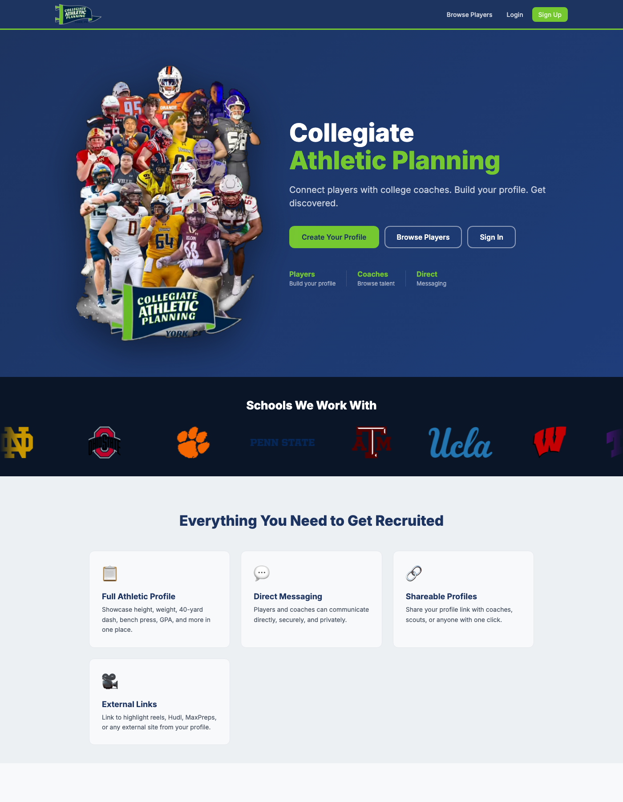
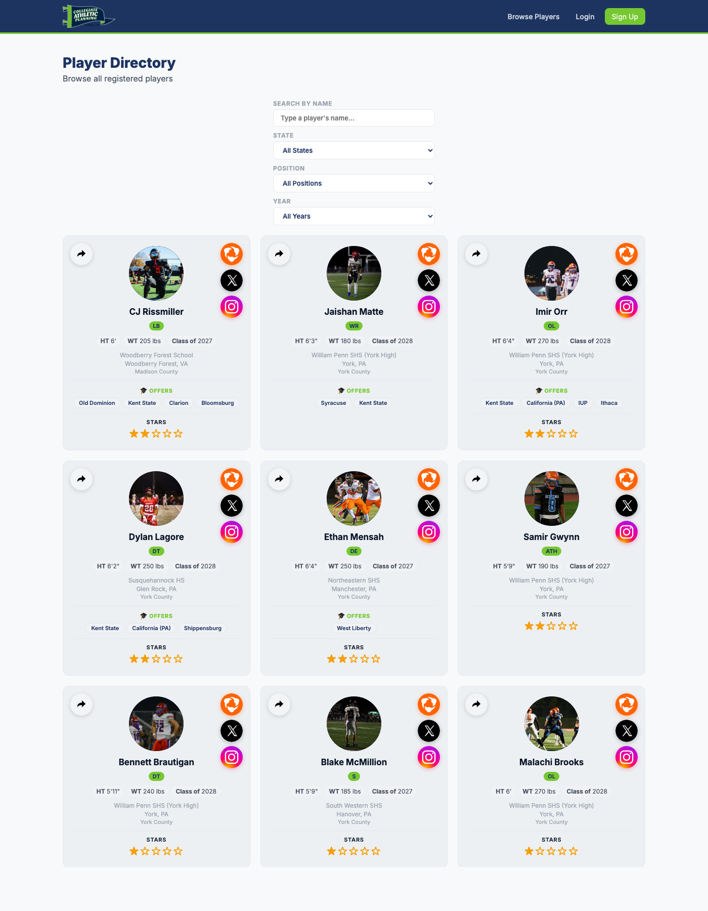
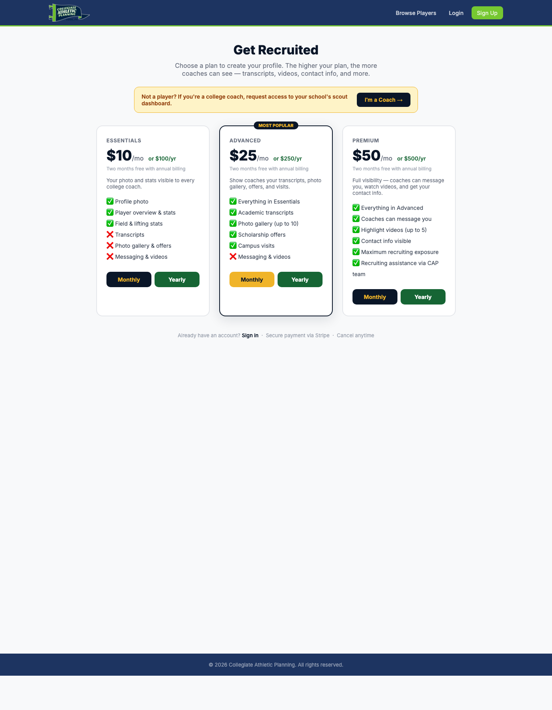
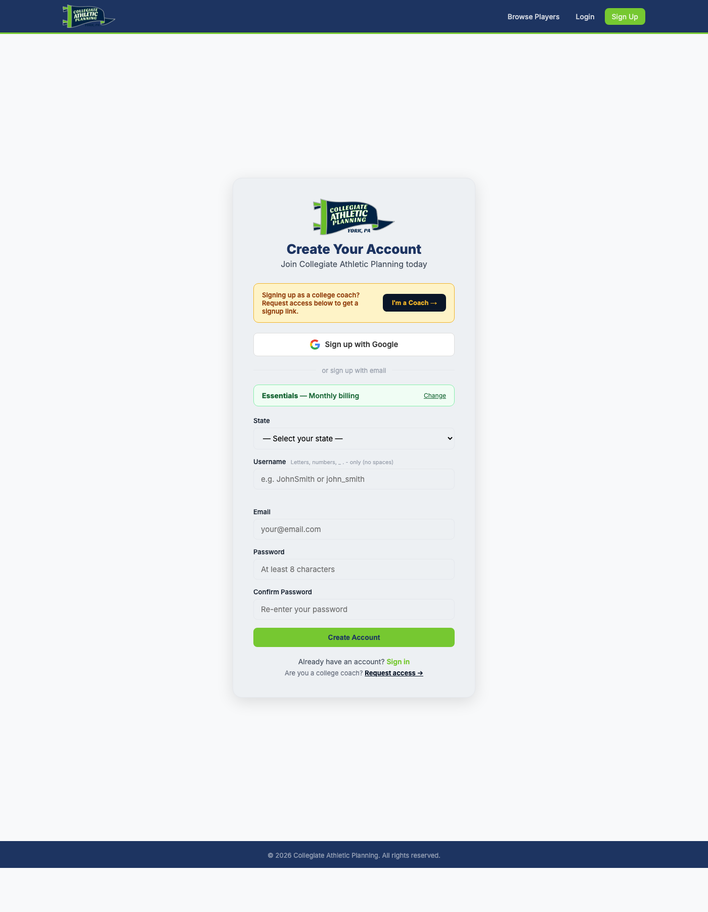

<h1 align="center" style="border-bottom: none">
    <b>
        <a href="https://caprecruiting.com">CAP Recruiting</a><br>
    </b>
    🏈  The Recruiting Platform for High School Football  🏈 <br>
</h1>

<p align="center">
CAP Recruiting connects high school football players with college coaches — a tier-based profile platform with real-time messaging, campus offers, and highlight video distribution.
</p>

<p align="center">
<a href="https://caprecruiting.com"></a>
<a href="https://github.com/divinedavis/CAPRecruiting"></a>
<a href="https://github.com/divinedavis/CAPRecruiting"></a>
<a href="https://github.com/divinedavis/CAPRecruiting/commits/main"></a>
<a href="https://opensource.org/licenses/AGPL-3.0"></a>
</p>

<p align="center">
    <a href="https://caprecruiting.com"><b>Website</b></a> •
    <a href="https://caprecruiting.com/pricing"><b>Pricing</b></a> •
    <a href="https://caprecruiting.com/signup"><b>Sign Up</b></a> •
    <a href="https://caprecruiting.com/dashboard"><b>Browse Players</b></a> •
    <a href="https://www.linkedin.com/in/divinejdavis"><b>LinkedIn</b></a> •
    <a href="mailto:divinejdavis@gmail.com"><b>Contact</b></a>
</p>

<p align="center"></p>
<p align="center"></p>
<p align="center"></p>
<p align="center"></p>

## What It Does

Players get a professional recruiting profile that coaches can discover and evaluate. Profile visibility scales with tier — players pay, coaches browse free.

| Tier | Price | What Coaches See |
|------|-------|------------------|
| **Free** | — | Visitors only — preview cards, no profile access |
| **Essentials** | $10/mo | Profile photo, overview, field & lifting stats |
| **Advanced** | $25/mo | + Transcripts, photo gallery, scholarship offers, campus visits |
| **Premium** | $50/mo | + Highlight videos, contact info, direct messaging |

Subscriptions run through Stripe. Players pick a plan at signup and can upgrade or cancel anytime.

## Features

- **Player profiles** — stats (field, lifting, physical), GPA, NCAA eligibility, bio, social links, up to 5 offers, up to 5 campus visits
- **Photo galleries** — up to 20 photos per player with in-page lightbox (Advanced+)
- **Transcripts** — up to 4 PDFs/DOCX per player with embedded viewer (Advanced+)
- **Highlight videos** — up to 5 pinned reels per player (Premium)
- **Coach messaging** — real-time WebSocket chat with unread badges (Premium)
- **Scout board** — coach-only evaluation notes and 0–5 star ratings
- **Marketing CRM** — lead pipeline, follow-ups, email campaigns with open/click tracking
- **Admin panel** — user management, tier overrides, team invites, campaign analytics
- **Player directory** — public-facing, searchable, filterable by school / position / year
- **Open Graph previews** — every profile shares with a rich iMessage/Twitter card

## Built With

- [FastAPI](https://fastapi.tiangolo.com/)
- [SQLite](https://www.sqlite.org/) via [SQLAlchemy](https://www.sqlalchemy.org/)
- [Jinja2](https://jinja.palletsprojects.com/) + vanilla HTML/CSS
- [Uvicorn](https://www.uvicorn.org/) + [Nginx](https://nginx.org/)
- [Stripe](https://stripe.com/) (Checkout, Customer Portal, Webhooks)
- [DigitalOcean Spaces](https://www.digitalocean.com/products/spaces) via boto3 for video/image/transcript storage
- WebSockets for real-time chat and unread badges
- [Let's Encrypt](https://letsencrypt.org/) / Certbot for SSL

## Getting Started with development

```bash
git clone git@github.com:divinedavis/CAPRecruiting.git
cd CAPRecruiting

python3 -m venv venv
source venv/bin/activate
pip install -r requirements.txt

# configure .env (DATABASE_URL, STRIPE_*, DO_SPACES_*, GMAIL_*, SESSION_SECRET)
cp .env.example .env

uvicorn main:app --reload --port 8080
```

Open [http://localhost:8080](http://localhost:8080). The SQLite schema auto-creates on first run.

## Roadmap

- [ ] Coach-initiated bulk messaging (gated by tier)
- [ ] Player analytics — profile views, messages, offer conversion
- [ ] Video transcoding pipeline (HLS) for faster playback on slow connections
- [ ] Mobile-native iOS app

## Stay Up-to-Date

<p align="center"></p>

## Contributing

Contributions are welcome — bug reports, fixes, and feature ideas. If you spot something broken or want to propose an enhancement, [open an issue](https://github.com/divinedavis/CAPRecruiting/issues/new) and we can talk through it before you start coding.

## Join the community

<a href="https://github.com/divinedavis/CAPRecruiting/graphs/contributors">
  
</a>

## Why Are We Building This?

High school football recruiting has been dominated by expensive, gate-kept services for years. Families pay hundreds or thousands a year for a profile that a coach might never see. Coaches, meanwhile, are drowning in unsolicited emails, Hudl links, and text messages — with no consistent place to evaluate a kid's stats, transcripts, and film side by side.

CAP Recruiting flips that. Players pay a modest monthly fee for a profile that actually surfaces in a searchable directory coaches can browse for free. Coaches get stats, transcripts, photos, and film in one consistent layout. Messaging is gated so players don't drown in spam and coaches don't waste time chasing the wrong fit.

The core values behind the project:

- **Transparent pricing** — everything a player gets for each tier is listed on the pricing page, no sales calls
- **Coach-friendly** — free for coaches, clean data, no noise
- **Fair visibility** — the player controls their own exposure, not an algorithm

We're not trying to replace Hudl or the NCSA-style agencies — we're building something simpler and more honest for the families and coaches who want a direct, searchable platform without the markup.

## License

Distributed under the GNU AGPLv3 License. See [`LICENSE`](./LICENSE) for the full text.

In short: you can use, study, modify, and redistribute this code under the AGPLv3. If you run a modified version as a network service, you must offer the source of your modifications to users of that service.

## Acknowledgments

Built with these excellent open-source projects:

- [FastAPI](https://fastapi.tiangolo.com/) — the backbone of the server
- [SQLAlchemy](https://www.sqlalchemy.org/) — ORM
- [Stripe](https://stripe.com/) — payments
- [DiceBear](https://www.dicebear.com/) — illustrated avatars in the admin marketing dashboard
- [contrib.rocks](https://contrib.rocks) — contributor grid
